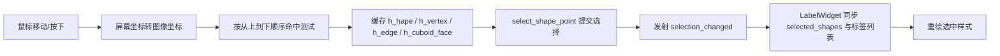

# Canvas 对象选择算法说明

## 1. 文档范围

本文总结画布编辑模式下的对象命中、悬停、单选、多选、取消选择和选择状态同步算法。

主要源码：

- `anylabeling/views/labeling/widgets/canvas.py`：鼠标事件、命中优先级和选择状态机。
- `anylabeling/views/labeling/shape.py`：顶点、边、图形内部区域等几何命中测试。
- `anylabeling/views/labeling/label_widget.py`：接收选择信号，同步画布与标签列表。

用户所指的 `canva.py` 实际文件名为 `canvas.py`。

## 2. 总体设计

选择过程被拆成三个阶段：

1. **坐标转换与悬停探测**：`Canvas.mouseMoveEvent()` 把鼠标坐标转换到图像坐标系，按显示层级查找候选对象，并缓存当前悬停的对象、顶点、边或立方体面。
2. **提交选择**：`Canvas.mousePressEvent()` 在编辑模式下调用 `select_shape_point()`，根据悬停缓存和几何命中结果产生新的选择列表。
3. **状态同步**：`selection_changed` 信号连接到 `LabelWidget.shape_selection_changed()`。后者更新 `Canvas.selected_shapes`、每个 `Shape.selected` 标志、标签列表选中项及相关操作按钮。



`Canvas` 不在 `select_shape_point()` 内直接维护最终选择集合，而是发射信号，由上层统一写回。这避免了画布和标签列表各自维护一份不一致的选择状态。

## 3. 关键状态

| 状态 | 含义 |
| --- | --- |
| `shapes` | 当前画布中的全部对象；列表顺序也是绘制层级顺序。 |
| `selected_shapes` | 当前选中的对象列表。 |
| `h_hape` | 当前鼠标命中的对象。源码沿用了拼写 `h_hape`。 |
| `h_vertex` | 当前命中的顶点或立方体控制点索引。 |
| `h_edge` | 当前命中的可插点边索引。 |
| `h_cuboid_face` | 当前命中的立方体侧面或后面名称。 |
| `h_shape_is_selected` | 鼠标按下时，命中对象是否已经在选择集中；用于单击释放时切换为未选中。 |
| `epsilon` | 基础命中半径，默认 `10.0`。 |
| `scale` | 当前缩放比例。命中半径通常使用 `epsilon / scale`，从而保持近似固定的屏幕像素范围。 |
| `visible` | `Canvas` 维护的对象可见性映射；不可见对象不参与常规选择。 |
| `_hide_backround` | 选中对象后是否隐藏其他对象的绘制状态，不改变正常选择算法本身。 |

## 4. 坐标与命中容差

事件位置先通过 `transform_pos()` 从控件坐标转换到图像坐标。几何计算都在图像坐标系中完成。

普通顶点、边和立方体控制点的命中半径为：

```text
R = epsilon / scale
```

点、直线和折线对象为了更容易被选中，使用三倍范围：

```text
R_sparse = 3 * epsilon / scale
```

因此缩放画布后，用户在屏幕上感受到的可点击范围基本不变。

## 5. 显示层级与对象优先级

绘制时按 `self.shapes` 正序绘制，后加入列表的对象最后绘制，视觉上位于上层。命中测试使用 `reversed(self.shapes)`，所以重叠区域优先选择视觉上最上层的对象。

对同一个候选对象，悬停命中的优先级为：

1. 立方体可见控制点；
2. 立方体正面；
3. 立方体可编辑侧面或后面；
4. 普通顶点；
5. 支持插点的边；
6. 对象主体区域。

层级优先于特征优先级：如果上层对象的主体已经命中，循环会立即结束，不会继续检查下层对象的顶点。

## 6. 悬停探测算法

`mouseMoveEvent()` 在非绘制、非拖动状态下遍历所有可见对象。找到第一个命中项后立即 `break`，并更新光标、提示文本和高亮状态。

### 6.1 顶点命中

`Shape.nearest_vertex(point, epsilon)` 计算鼠标点到每个顶点的欧氏距离，只接受距离不大于阈值的顶点，并返回其中最近者：

```text
arg min distance(vertex[i], mouse)
subject to distance <= epsilon
```

普通图形检查全部顶点。立方体的通用 `nearest_vertex()` 只检查前四个正面顶点；其他可见后部顶点和边中点由立方体专用控制点算法处理。

命中后写入 `h_hape` 和 `h_vertex`，清空边、立方体面缓存，并显示点形光标。

### 6.2 边命中

如果没有命中顶点，则调用 `Shape.nearest_edge()`：

- 计算鼠标点到每条线段的距离；
- 只保留距离小于等于 `epsilon / scale` 的边；
- 返回最近边的后端点索引，供 `insert_point()` 插入新顶点。

边只有在 `shape.can_add_point()` 为真且对象不是 `quadrilateral` 时才成为悬停目标。目前可插点类型主要是 `polygon` 和 `linestrip`。

### 6.3 主体命中

不同图形采用不同规则：

| 图形类型 | 主体命中规则 |
| --- | --- |
| `point`、`line`、`linestrip` | 不检测填充区域；鼠标只要接近任一顶点，距离不超过 `3 * epsilon / scale` 即命中。 |
| `cuboid` | 常规主体选择只检测正面四边形。侧面和后面由专用面命中算法处理。 |
| `circle` | 使用 `QPainterPath` 椭圆区域的 `contains()`。 |
| `polygon`、`rectangle`、`rotation`、`quadrilateral` | 使用由顶点构造的 `QPainterPath.contains()` 判断鼠标是否位于图形区域内。 |

这意味着 `line` 和 `linestrip` 的中间线段本身不是主体选择区；距离所有顶点都较远时，即使鼠标紧贴线段也不会按主体命中。

### 6.4 立方体专用命中

完整立方体由 8 个顶点表示。`nearest_cuboid_control()` 只遍历当前可见控制点，并选择阈值内距离最近者。控制点包括：

- 正面 4 个顶点；
- 根据深度方向可见的 2 个后部顶点；
- 正面左、右、上、下四条边的中点；
- 一个可见后部竖边中点。

未命中控制点时，先测试正面四边形。再由 `cuboid_face_hit_test()` 测试左右侧面和后面：

- 深度向量 `x < 0` 时先测左面，再测右面；否则顺序相反；
- 最后测试后面；
- 返回第一个包含鼠标点的面。

代码中虽然定义了上、下表面常量，但当前 `cuboid_face_hit_test()` 没有把上、下表面加入测试顺序。

### 6.5 未命中处理

当所有对象都未命中时，`un_highlight()` 清空对象、顶点、边和立方体面缓存，光标恢复为默认箭头，同时清除工具提示。

## 7. 单击选择算法

编辑模式下按下鼠标左键时，`mousePressEvent()` 计算：

```python
multiple_selection_mode = (
    modifiers == QtCore.Qt.KeyboardModifier.ControlModifier
)
```

随后调用 `select_shape_point(point, multiple_selection_mode)`。

注意这里使用“完全等于 Ctrl”，因此 Ctrl 与其他修饰键组合按下时不会进入多选模式。

### 7.1 命中来源

`select_shape_point()` 优先复用悬停阶段缓存的特殊命中：

1. 若 `h_vertex` 存在，优先处理立方体或旋转框顶点；
2. 否则若 `h_cuboid_face` 存在，选择对应立方体；
3. 否则重新按 `reversed(self.shapes)` 扫描可见对象主体。

主体重扫规则与悬停主体规则基本相同：点、线、折线检查三倍半径内的顶点，立方体检查正面，其他图形检查内部区域。

### 7.2 选择集合更新

命中一个未选对象时：

| 模式 | 发射的新选择列表 |
| --- | --- |
| 普通单击 | `[hit_shape]`，替换原选择。 |
| Ctrl 单击 | `selected_shapes + [hit_shape]`，追加到原选择。 |

命中已经选中的对象时，不立即改变选择列表，而是把 `h_shape_is_selected` 设为 `True`。鼠标左键释放且没有发生拖动时，`mouseReleaseEvent()` 发射删除该对象后的列表：

```text
[shape for shape in selected_shapes if shape != h_hape]
```

因此当前行为是“再次单击已选对象可取消选择”；该切换并不要求按住 Ctrl。若按下后发生拖动，`moving_shape == True`，释放时不会取消选择。

### 7.3 点击空白区域

未命中任何对象时调用 `deselect_shape()`，发射空列表 `[]`，清除全部选择并关闭背景隐藏状态。

### 7.4 右键行为

编辑模式下右键按下时：

- 当前无选择，或悬停对象不在现有选择中：先执行一次选择；
- 右键位于已有选择上：保留现有选择；
- Ctrl 右键也可追加对象；
- 后续右键拖动使用 `selected_shapes_copy` 生成影子副本，并在释放时显示对应上下文菜单。

## 8. 选择状态同步

`select_shape_point()` 和 `deselect_shape()` 主要通过 `selection_changed(list)` 表达“期望的新选择集合”。同一 GUI 线程中的信号连接随后执行 `LabelWidget.shape_selection_changed()`：

1. 清除旧选择对象的 `shape.selected` 标志；
2. 清空标签列表选择；
3. 把新列表赋给 `canvas.selected_shapes`；
4. 给新选择对象设置 `shape.selected = True`；
5. 选中并滚动到对应标签列表项；
6. 根据选择数量和类型启用删除、复制、编辑、合并等操作。

标签列表反向选择对象时，`label_selection_changed()` 收集列表中的选中项，再调用 `canvas.select_shapes()` 发射同一个信号。因此画布选择与标签列表选择共用同一同步入口。

## 9. 自动悬停选择

配置 `auto_highlight_shape` 开启后，`LabelWidget` 会把该值写入 `canvas.h_shape_is_hovered`。鼠标进入对象主体时，`mouseMoveEvent()` 会直接调用 `select_shape_point()`，无需单击即可更新选择。

自动模式仍使用 Ctrl 是否单独按下决定追加或替换。由于它发生在鼠标移动事件中，重叠对象、可见性和主体命中规则与普通悬停相同。

## 10. 双击编辑标签的独立命中

双击编辑标签使用独立命中循环：

- 按 `reversed(self.shapes)` 查找最上层可见对象；
- 点、线和折线仍使用三倍顶点半径；
- 其他对象统一使用 `shape.contains_point()`；
- 命中未选对象时先将其设为唯一选择，再发射 `edit_label_requested`。

该规则与单击选择不完全相同。尤其是 `Shape.contains_point()` 对立方体使用整体包围矩形，因此双击立方体包围框内的区域可能触发编辑，而普通主体单击只接受正面或已由悬停识别的可编辑侧面/后面。

## 11. 简化伪代码

```text
on mouse move(position):
    point = transform_to_image(position)

    for shape in visible_shapes_from_top_to_bottom:
        if cuboid_control_hit(shape, point):
            cache(shape, vertex=control_index)
            break
        if cuboid_front_hit(shape, point):
            cache(shape)
            break
        if cuboid_side_or_back_hit(shape, point):
            cache(shape, cuboid_face=face)
            break
        if nearest_vertex_hit(shape, point):
            cache(shape, vertex=index)
            break
        if addable_edge_hit(shape, point):
            cache(shape, edge=index)
            break
        if body_hit(shape, point):
            cache(shape)
            break
    else:
        clear_hover_cache()

on mouse press(position, modifiers):
    multi = (modifiers == Ctrl)
    shape = hit_from_hover_cache_or_body_rescan(position)

    if no shape:
        emit selection_changed([])
    else if shape not selected:
        emit selection_changed(selected + [shape] if multi else [shape])
    else:
        remember_already_selected(shape)

on left mouse release:
    if pressed_shape_was_already_selected and not moved:
        emit selection_changed(selected - pressed_shape)
```

## 12. 实现注意事项与潜在边界

以下行为是当前源码的直接结果，修改选择体验时应重点回归：

1. `select_shape_point()` 的文档字符串写的是“选择第一个创建且包含该点的图形”，实际使用逆序遍历，选择的是列表中最后加入、视觉上最上层的图形。
2. 点、直线、折线只通过“靠近顶点”进行主体选择，长线段中部可能难以选中。
3. `nearest_edge()` 把最后一个点到第一个点也作为一条边；对开放的 `linestrip`，这可能形成一条仅用于命中计算的隐含闭合边。
4. 普通多边形、矩形和四边形的顶点缓存进入 `select_shape_point()` 后，没有像 `rotation`、`cuboid` 顶点分支一样提交该对象选择，函数随后可能执行取消选择。顶点拖动依赖 `h_hape` 仍可继续，但选择状态可能出现与预期不同的变化。
5. 立方体上、下表面常量已经定义，但当前面命中仅处理左、右和后面。
6. 再次单击已选对象会取消选择，即使没有按 Ctrl；这与部分桌面软件“普通单击保持单选”的交互习惯不同。
7. `Canvas.is_visible()` 查询 `Canvas.visible` 映射，而部分绘制分支直接查询 `Shape.visible`。正常入口会同步二者，但新增调用路径时应避免两套可见状态不一致。

## 13. 关键源码索引

| 功能 | 文件与位置 |
| --- | --- |
| 选择信号和核心状态 | `canvas.py:47-176` |
| 清除悬停状态 | `canvas.py:488-508` |
| 鼠标移动与完整悬停命中 | `canvas.py:531-997` |
| 左/右键提交选择 | `canvas.py:1069-1282` |
| 释放已选对象时取消选择 | `canvas.py:1285-1311` |
| 双击编辑标签命中 | `canvas.py:1348-1384` |
| 主选择算法 | `canvas.py:1397-1498` |
| 立方体控制点和面命中 | `canvas.py:1658-1719` |
| 取消选择 | `canvas.py:2066-2073` |
| 图形顶点、边、主体几何测试 | `shape.py:695-773` |
| 立方体可见控制点 | `shape.py:323-380` |
| 信号连接与最终状态同步 | `label_widget.py:423`、`label_widget.py:4326-4359` |
| 标签列表反向选择画布对象 | `label_widget.py:4744-4754` |
