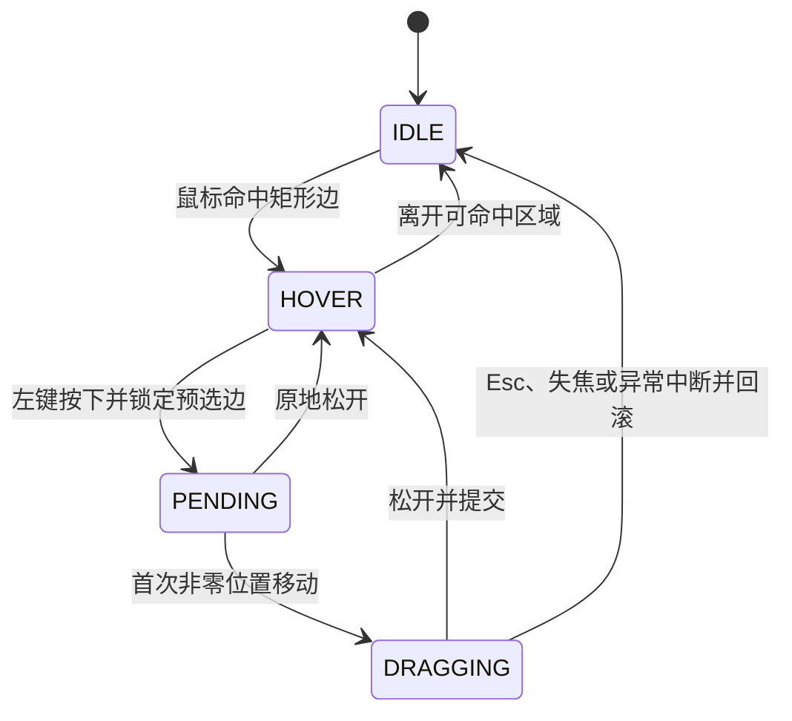

# 矩形边编辑功能说明

> 适用范围：X-AnyLabeling 当前仓库实现
> 文档基准：2026-08-04 代码状态
> 核心能力：使用鼠标独立编辑轴对齐矩形的左、上、右、下任意一条边

## 1. 功能定位

矩形边编辑解决“只修正一条边”的问题。传统的矩形顶点拖动会同时改变宽和高，整体移动又无法改变尺寸；本功能把矩形四条边分别作为鼠标操作对象，适合目标框边界贴合、密集目标分界调整和精细修框。

当前功能刻意保持单一主流程：

```text
开启矩形边编辑
→ 选中一个矩形并悬停其边
→ 按下并锁定该边
→ 首次有效移动立即调整
→ 拖动单边
→ 松开提交，或 Esc 回滚
```

以下三个低使用价值的扩展已经移除：

- `Tab` 键盘选边及单边方向键微调；
- 稳定精修预览窗口；
- Sobel 局部边缘吸附。

鼠标精修降速仍保留，可在拖边时按住 `Ctrl` 临时启用，或通过“精修模式锁定”持续启用。

## 2. 用户操作

### 2.1 鼠标直接拖边

1. 按 `Ctrl+Shift+E` 开启“矩形单边调整”。如果当前处于绘制模式，系统会先切回编辑模式。
2. 正式选中且仅选中一个矩形。将鼠标移动到该矩形的边附近；可命中的边显示白色细线，鼠标变为对应方向的水平或垂直缩放光标。
3. 按住左键后，首个位置确实变化的鼠标移动事件会立即开始拖动该边；没有固定的像素启动阈值。
4. 松开左键提交修改。一次完整拖拽对应一次撤销记录。

未选中矩形、多选状态和非矩形不会进入单边调整。按下和拖动全过程保留原矩形的正式选择，因此属性面板、三框聚焦等选择观察者保持稳定。

普通矩形可从边界内外命中边；屏幕短边小于 `3 × epsilon` 的小矩形只允许从框外拉边，框内继续保留给原有移动和选择操作。

### 2.2 精修降速

拖动矩形边时可以：

- 按住 `Ctrl`：临时降低鼠标拖动速度；
- 按 `Ctrl+Alt+F`：锁定或解除精修降速，不必持续按住 `Ctrl`。

默认使用 `zoom` 模式，实际降速倍率随画布缩放变化，并受最大倍率限制。该能力只改变拖动增量，不改变鼠标命中、hover 和坐标换算。

### 2.3 取消与中断

- 拖动过程中按 `Esc`：恢复到按下前的矩形坐标，但保持功能开关开启；
- 仅按下、尚未产生位置变化时按 `Esc`：取消 pending 状态，不改变几何；
- 关闭“矩形边编辑”：若正在拖动，先回滚本次修改，再清空临时状态；
- 窗口失焦、鼠标抓取被系统中断，或拖动期间检测不到左键：自动回滚；
- 单击边但没有形成拖动：不修改矩形，也不产生撤销记录。

键盘行为已经恢复为通用画布语义：`Tab` 不再被 Canvas 用于选边；方向键移动整个正式选中的对象，`Shift+方向键` 使用较大步长。

## 3. 交互状态机

鼠标边编辑由 `RectEdgeInteractionController` 管理，四个阶段互斥：



| 状态 | 核心数据 | 是否修改几何 |
| --- | --- | --- |
| `IDLE` | 无边引用 | 否 |
| `HOVER` | `hover_edge` | 否 |
| `PENDING` | `pending_edge`、按下的屏幕坐标和图像坐标 | 否 |
| `DRAGGING` | `active_edge`、`drag_start_points` | 是，实时预览 |

`phase` 根据完整状态载荷推导，不再使用可以互相矛盾的独立布尔状态。

## 4. 命中与事件优先级

### 4.1 命中范围

命中阈值使用 `epsilon / scale` 从屏幕尺度转换到图像坐标，因此画布缩放后，可点击宽度在视觉上基本稳定。几何层用点到线段的距离判断是否命中。

### 4.2 候选排序

鼠标单边调整只枚举当前唯一选中矩形的四条边，并按到边的距离选择候选。按下时优先重新验证当前白色预选边；进入 pending 后锁定该边，拖动期间不会因经过其他矩形、角点或边切换目标。

### 4.3 顶点优先

当前选中矩形的原生顶点优先于它的边。鼠标位于该矩形角点附近时，继续执行原有角点编辑，不启动单边调整；其他形状不会抢占已选中矩形的边手势。

### 4.4 事件仲裁

活动边拖拽在 `mouseMoveEvent` 中具有最高优先级，会提前消费事件，防止继续进入顶点移动、对象整体移动或画布平移逻辑。

## 5. 几何模型与安全约束

### 5.1 规范化矩形

`rect_edge_alignment.py` 使用两个不可变数据类：

- `RectGeometry`：以 `x_min`、`y_min`、`x_max`、`y_max` 表示规范化轴对齐矩形；
- `RectEdgeRef`：某条边的临时句柄，包含所属 `Shape`、边名、轴、坐标和端点。

几何读取兼容 2 点对角形式与 4 点矩形形式。修改后统一写回四点规范顺序：左上 → 右上 → 右下 → 左下，并主动使 `Shape` 的路径和包围盒缓存失效。

### 5.2 单边修改规则

| 编辑边 | 改变的坐标 | 保持不变 |
| --- | --- | --- |
| 左边 | `x_min` | `x_max`、`y_min`、`y_max` |
| 右边 | `x_max` | `x_min`、`y_min`、`y_max` |
| 上边 | `y_min` | `y_max`、`x_min`、`x_max` |
| 下边 | `y_max` | `y_min`、`x_min`、`x_max` |

标签、`group_id`、属性和选择状态等业务数据不参与几何修改。

### 5.3 反翻转与图像边界

`geometry_with_edge_coord()` 保证矩形最小宽高为 1 个图像像素：

- 左边不超过 `x_max - 1`；
- 右边不小于 `x_min + 1`；
- 上边不超过 `y_max - 1`；
- 下边不小于 `y_min + 1`。

鼠标拖动还会先把候选坐标限制到图像的 `[0, width - 1]` 或 `[0, height - 1]`，因此矩形不会翻转、坍塌或被直接拖出图像。

## 6. 提交、撤销与持久化

拖动期间直接修改内存中的 `Shape.points`，以获得实时反馈；`drag_start_points` 保存完整起始坐标，用于取消回滚。

松开时逐点比较当前坐标与起始坐标：

- 几何确实变化：调用 `store_shapes()`，发出 `shape_moved`，形成一次撤销粒度；
- 几何未变化：不写撤销栈，不发移动信号。

`RectEdgeRef`、hover、pending 和 active 等状态只存在于内存，绝不写入标注 JSON，也不写入 `Shape.other_data`、`flags` 或 `attributes`。真正持久化的仍只有修改后的矩形点坐标。

## 7. 精修降速实现

`_effective_drag_pos()` 使用独立虚拟游标缩放拖拽增量，不改写真实鼠标位置和 `prev_point`。因此 hit-test、hover、坐标变换和基础交互仍使用原始坐标。

默认配置为 `zoom` 模式：

```text
precision_factor = min(max(canvas_scale, 1), max_factor)
```

默认最大倍率为 2.0。也可配置为 `fixed` 模式，使用固定倍率。精修通过按住 `Ctrl` 临时启用，或通过“精修模式锁定”持续启用。

## 8. 模式切换语义

- 功能开启时若正在绘制，`LabelingWidget` 立即切换到编辑模式；
- 之后切到创建模式时，能力开关保持开启但处于休眠状态；
- 进入创建模式会取消正在进行的拖动并恢复起始几何；
- 功能每次启动默认为关闭，不持久化开关状态；
- 隐藏、移除或被过滤为不可交互的矩形不参与命中。

## 9. 视觉反馈

| 场景 | 边样式 | 光标 |
| --- | --- | --- |
| 可拖边 hover | 白色细实线 | 水平或垂直缩放 |
| 正在拖动的边 | 白色中等粗实线 | 水平或垂直缩放 |
| 非参与矩形 | 原有轮廓样式 | 原有规则 |

线宽会随 `Shape.scale` 抵消缩放，使视觉粗细基本稳定。边 overlay 在普通形状之后绘制，确保高亮覆盖原轮廓。

## 10. 配置项

默认配置位于 `anylabeling/configs/xanylabeling_config.yaml`：

| 配置 | 默认值 | 含义 |
| --- | --- | --- |
| `shortcuts.toggle_rect_edge_align` | `Ctrl+Shift+E` | 开关鼠标矩形边编辑 |
| `shortcuts.toggle_precision_mode_lock` | `Ctrl+Alt+F` | 锁定或解除鼠标精修降速 |
| `canvas_precision_mode` | `zoom` | 精修倍率模式：`fixed` 或 `zoom` |
| `canvas_precision_max_factor` | `2.0` | `zoom` 模式最大降速倍率 |
| `canvas_precision_factor` | `4` | `fixed` 模式降速倍率 |

单边拖动不使用固定启动阈值；1 px 最小矩形尺寸是代码约束，不是用户配置项。

## 11. 代码结构

| 文件 | 职责 |
| --- | --- |
| `anylabeling/views/labeling/rect_edge_alignment.py` | 矩形规范化、边枚举、命中、单边坐标修改和反翻转 clamp |
| `anylabeling/views/labeling/rect_edge_interaction.py` | 鼠标四阶段状态以及取消、清理事务 |
| `anylabeling/views/labeling/widgets/canvas.py` | 鼠标事件仲裁、实时修改、提交/回滚、overlay 和精修降速 |
| `anylabeling/views/labeling/label_widget.py` | 菜单 action、快捷键、状态栏反馈和模式切换接线 |
| `anylabeling/configs/xanylabeling_config.yaml` | 快捷键及精修默认参数 |

主要调用链：

```text
LabelingWidget.toggle_rect_edge_align
  -> Canvas.set_rect_edge_align_enabled
  -> Canvas.mouseMoveEvent / mousePressEvent / mouseReleaseEvent
  -> rect_edge_alignment.nearest_edge / apply_edge_coord
  -> Canvas.store_shapes + shape_moved
```

## 12. 测试覆盖

| 测试文件 | pytest 用例数 | 主要覆盖 |
| --- | ---: | --- |
| `tests/test_rect_edge_alignment.py` | 21 | 2/4 点规范化、四边枚举、命中、单边修改、反翻转、元数据不变 |
| `tests/test_rect_edge_canvas_semantics.py` | 见当前测试收集结果 | 已选中矩形、首次有效移动、原地单击、相邻边锁定、顶点优先、图像边界、失焦回滚、模式切换 |
| `tests/test_rect_edge_state_models.py` | 2 | 显式鼠标阶段和边操作视觉状态不落入 `Shape` |
| `tests/test_precision_mode.py` | 6 | fixed/zoom 精修、关闭直通和连续拖动无漂移 |

合计 61 个 pytest 自动化用例。高风险不变量包括：顶点优先、预选目标不跳边、取消必须逐点恢复、矩形不能翻转或越界、一次鼠标拖拽只产生一次撤销。

## 13. 与滚轮矩形编辑的区别

仓库另有 `canvas.wheel_rectangle_editing`，默认开启，但它不是“矩形边编辑”菜单模式的一部分：

- 要求正式单选一个矩形；
- 鼠标位于框内时，滚轮按中心整体缩放矩形；
- 鼠标位于框外时，滚轮按固定步长调整离光标最近的边；
- `Ctrl+滚轮` 仍用于画布缩放。

直接拖边提供可视预选、首次有效移动、取消回滚、精修降速及独立状态机，是主要的交互式单边编辑方式。

## 14. 维护约束

1. `RectEdgeRef` 和交互状态不得序列化。
2. 几何修改必须走规范化与反翻转逻辑，并使 `Shape` 缓存失效。
3. 鼠标命中必须保留当前选中矩形的顶点优先和不可交互对象过滤。
4. pending 只区分原地单击与首次非零移动；hit-test 使用随缩放换算的图像阈值。
5. 活动拖拽必须早于画布平移、对象移动和顶点移动处理。
6. 所有异常中断路径必须恢复 `drag_start_points`。
7. 松开时只有实际几何变化才能写撤销栈和发出 `shape_moved`。
8. 新增交互路径时同时补齐正常提交、Esc、关闭开关、切图、失焦和鼠标抓取中断测试。

## 15. 历史说明

早期方案曾包含“参考边对齐”、键盘选边、局部边缘吸附和稳定精修预览。当前产品范围已经收缩为“鼠标直接拖动单边 + 可选鼠标精修降速”。旧设计文档只作为历史记录，不代表现行行为。
