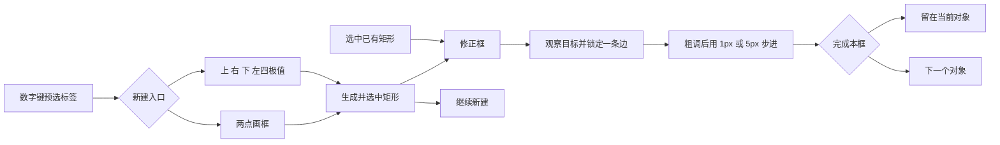

## Context

本方案为待实施设计，覆盖普通水平矩形。动机见 [proposal.md](proposal.md)。默认沿用数据集已有的可见框或完整框规则，不替用户更改标注口径。

当前代码已包含单边拖动、精修增益、1px/5px 微调、Tab 切边和局部放大组件。仓库默认 `rectangle_review_refinement.enabled: false`，因此代码存在不能等同于用户已启用或效果已验收。旧精修变更仍有未完成验收项；本方案复用其基础，补齐新建入口和连续工作流。

本方案最关键的产品约定：鼠标确定大致位置，单边输入确定最后几像素，系统管理视图和几何约束。减少的是完成合格框的总成本，不把点击次数当作唯一指标。

## Goals / Non-Goals

**Goals:**

- 让“新建后修边”和“质检修边”使用同一套操作习惯。
- 对小目标提供容易调用的观察尺度，对清晰目标保持短流程。
- 输入错误能够就地回退；精修不会误动其他边或其他对象。
- 以原图坐标衡量精度，以包含观察与返工的总耗时衡量效率。

**Non-Goals:**

- 本期不扩展旋转框、四边形或关键点，不引入新的 JSON 类型。
- 本期不接入自动边缘吸附、自动分割拟合或生成式增强；这些能力需单独验证语义正确性。
- 不增加强制逐边审批或新的质检结论字段；“完成修正”不等于“质检通过”。

## Decisions

### 1. 两条入口，共用收尾

| 任务 | 入口 | 适用情况 | 收尾 |
|---|---|---|---|
| 快速新建 | 普通两点画框 | 大目标、角点容易推算 | 保持原流程，可主动进入修边 |
| 极值新建 | 四极值画框 | 极值明确、假想角点难找 | 自动选中新框，可修边或继续新建 |
| 质检修正 | 选中矩形 → 修正框 | 已有人工框或模型框 | 完成后留在本框，或显式下一个 |

普通两点入口保持默认。四极值入口记住本次会话的标签和工具选择，但不因一次尝试永久改变用户默认工具。

图中的两点路径仅表示可以衔接修边，不表示强制改变现有两点创建后的选择或工具状态。

### 2. 新建框：四极值直接生成矩形

工具显示名为“四极值画框”。固定输入顺序为上 → 右 → 下 → 左，与修正框的 Tab 顺序一致。用户寻找的是对象的极值位置，不是矩形角点。

| 步骤 | 界面提示 | 当前输入实际使用的坐标 | 即时反馈 |
|---|---|---|---|
| 1 | 点击对象最上方 | y_top | 水平上边线 |
| 2 | 点击对象最右方 | x_right | 竖直右边线 |
| 3 | 点击对象最下方 | y_bottom | 水平下边线 |
| 4 | 点击对象最左方 | x_left | 完整矩形 |

鼠标移动只预览当前待定边。每次左键按下确认一条边；按下和释放不能各记录一次。输入点以临时小标记显示，线段限于可见画布，样式让用户能看见轮廓。忽略与当前边无关的坐标，不对四个点求通用 min/max 或拟合旋转框。

原图矩形由 `(x_left, y_top, x_right, y_bottom)` 直接构造。浮点坐标使用现有精度，不强制取整；后续 1px 步进表示增加或减少 1，而非四舍五入原值。

第四次有效输入后自动生成一个矩形，作为一次创建撤销单元；沿用现有数字键预选标签和默认属性流程。若没有有效标签，调用既有标签确认，取消标签确认则返回四边草稿，不留下正式空标签框。临时点不进入 shape 列表，不分配正式点 ID 或额外 Group ID。矩形本身仍遵守现有创建、身份和业务分组规则。

提交后停留在“新框已选中”的状态，不自动激活某条边，也不自动改变视图。用户可以直接点边或按 Tab 修正，也可以按“继续新建”进入同标签的下一次四极值输入。“继续新建”复用可配置动作，具体默认快捷键经冲突审查确定；不能用背景点击隐式触发，以免检查时误画。

Backspace 撤回最近一条已确认边；Esc 丢弃整份草稿并退出本次输入。草稿期间 Ctrl+Z 只撤回草稿最近一条边，不穿透到历史标注；没有已确认边时为空操作。四边完成但标签确认被取消后，移动鼠标不自动重提交流程，可点“提交”重试或回退边界。

同一位置可以确定相邻的不同极值；不能仅因两个点击坐标相同就丢弃输入。若出现上下颠倒、左右颠倒、越界或小于现有最小尺寸，保留已确认边，拒绝当前输入并说明原因，不自动交换边名或调整坐标。切换工具或成功切图时丢弃未提交草稿；切图被既有保存流程取消时保留草稿。

**取舍：** 四次点击增加基础动作，但减少假想角点推算和后续双轴返工，因此作为并行入口试点。暂不采用任意顺序自动识别极值，避免错误推断用户当前表达的是哪条边。

### 3. 修正框：活动边明确，精度由固定步进提供

“修正框”动作仅在唯一选中普通矩形时可用。进入后显示四个大选边按钮“上 / 右 / 下 / 左”和当前步长，鼠标仍可在画布选边。按钮点击后焦点返回画布。空选中、多选或不支持的形状时不猜测操作目标。

| 输入 | 行为 |
|---|---|
| 选边按钮 | 明确激活该边；以后移动鼠标不会改变活动边 |
| 精修状态点击画布 / 普通状态 Alt+点击 | 在有限四区域中定位单边，贴边点击不武装微调；见 cls3-120 r4 |
| Tab / Shift+Tab | 上 → 右 → 下 → 左循环，或反向；无活动边时分别从上、左开始 |
| 左 / 右方向键 | 活动边为左边或右边时，沿原图 x 轴移动 -1 / +1px |
| 上 / 下方向键 | 活动边为上边或下边时，沿原图 y 轴移动 -1 / +1px |
| Shift + 有效方向键 | 对应移动 5px |
| 滚轮向上 / 向下 | 活动边坐标增加 / 减少 1px；Shift 为 5px |
| 拖动活动边 | 复用现有精修增益；Shift 临时粗调，恢复时不跳变 |
| Enter 或“完成修正” | 结束活动边及本框修正状态，保留已提交修改和当前对象 |
| “下一个对象” | 结束本框修正并走现有导航/保存流程，成功后进入下一目标 |

滚轮使用坐标增减语义，并显示“上滚：向右”或“上滚：向下”，不称为统一“向外”，因为左右边的向外方向不同。与边轴向无关的方向键被消费为空操作，不回落为整框移动；在修正框模式下无活动边时，方向键也不移动整框，并提示先选边。模式外保持既有整框移动行为。

悬停只能提示候选边，不能成为键盘修改授权。现有代码允许以 hover 回退为微调对象，而且方向键分派需核对轴向约束；这些是实施前要补齐的行为差异，不能直接沿用为新契约。

无活动边时滚轮保持现有画布行为；活动边锁定后才步进。Ctrl+滚轮保持现有缩放路由，不同时修边。高分辨率滚轮累计规范刻度；键盘长按依赖既有重复事件，不增加隐藏变速。文本编辑框、标签对话框或其他控件有焦点时，画布不截获文字、Tab 或方向键。

只改变活动边对应的一个坐标，其余三边不变。边越过对边、超出图像或违反最小尺寸时，拒绝整次输入并显示原因，不隐式裁剪成较小步长。若进入时框本身不满足编辑器几何约束，提示使用既有重画/修复路径；本工具不猜测非法框的归一化方式。

反馈显示“右边 · 1px · 本轮 Δx=-3px”，活动边高亮，原边用弱参照线表示；坐标与宽高放在辅助区域。原边基准在该边被激活时建立，撤销后刷新。未活动边使用低干扰线条，填充及标签沿用已有显示开关，不能用遮挡对象轮廓的粗线表达精度。

**撤销与退出：** 一次拖动为一单元；同目标、同边、同方向且输入间隔小于 500ms 的步进合并。换边、反向、超过时间窗口、完成或切对象结束合并。拖动中 Esc 回滚本次未提交拖动；没有拖动时 Esc 先解除活动边，再次 Esc 退出修正，保留已提交步进。Ctrl+Z 撤销已提交单元，不能跨文件误作用。Enter 不额外保存文件或写入“质检通过”。

### 4. 观察：区分新建前未知尺寸和已有框已知尺寸

新建之前没有目标框，系统无法仅从鼠标位置可靠得知人物大小。因此不承诺自动识别目标并完美放大。提供“局部聚焦”动作：以指针下原图坐标为锚点放大一级，可重复；它在画框前使用，也可在草稿中使用，已确认边的原图坐标保持不变。

对于已有框，提供“按对象放大”选项和“查看周围”动作。按对象放大默认关闭，用户启用后仅在显式进入修正或成功切换对象时执行一次。初始试点参数：以图像逻辑显示像素计算，目标长边约 400px，上限 8 倍原图比例；外围至少保留每侧 25% 框尺寸或 16 原图像素，取较大值，并裁到图像范围。比例同时受完整上下文能否放进视口约束，不承诺任何尺寸都达到 400px。参数是可调起点，须通过试点校准。

现有框可能漏标四肢，故不将紧裁剪视为对象全貌。“查看周围”恢复进入该对象前的视图；用户可手动继续缩小。需要再次聚焦时显式触发按对象放大。修边、Tab 切边、完成及新框第四次提交都不自动重算缩放。手动平移缩放在当前对象期间保持，不能被自动策略抢回。

复用既有 viewport 状态控制器，每次观察会话只保存一个进入前快照。退出观察或返回全图恢复该快照；成功切图后不将旧图快照应用到新图。仅保留“启用按对象放大”等偏好，不继承旧对象活动边、拖动或滚轮累计值。

已有局部放大镜保留为可选观察工具，不能从其截图坐标写回框坐标。候选框、新建草稿、最终框统一使用原图坐标；所有缩放、对比显示和临时图层不改变源图或标注。

### 5. 小目标与不确定边界

对于原图约 70×80 的人物，按对象放大在视口允许时可使其显示长边接近 400px，此时 1 原图像素位移约对应 5 逻辑显示像素。若受到最大倍率或上下文限制，则使用实际可达比例并显示，不虚报精度。

清晰边界按数据集精度标准修正；模糊边界采用预先约定的容差；不可见边界沿用数据集遮挡口径。工具不把放大显示当成恢复真实细节，不自动推测隐藏肢体。暂不能判断时可以结束修正并使用现有备注/复核流程，不强制创建新的标注属性或一键通过。

### 6. 实现分层与依赖协调

| 层 | 责任 |
|---|---|
| 独立四极值草稿控制器（建议新增） | 固定顺序、候选边、回退、合法性和完成状态；尽量纯 Python |
| 现有矩形几何与精修组件 | 坐标变更、精修增益、步进、撤销分组；复用并补齐契约 |
| Canvas 窄入口 | 事件路由、草稿及活动边绘制、调用现有 shape 创建/编辑通知 |
| LabelWidget / 动作与设置层 | 标签流程、工具入口、焦点、导航、dirty/save、i18n |
| 现有 viewport 控制层 | 原图坐标锚点、对象聚焦、手动视图优先和恢复 |

几何变更必须进入现有 dirty、撤销、保存及索引刷新路径，确保 Inspector 和缩略图在已有更新时机读取最新标注。使用现有 shape 身份机制定位目标，不能依赖易变的列表下标维持跨对象状态。

已有 `optimize-rectangle-review-refinement-workflow` 继续拥有增益、底层步进、反馈和遥测实现。本变更拥有四极值创建、显式修正模式及观察衔接。共同的“明确激活”和轴向规则按已有 spec 补齐，不新增一套平行引擎。实施前登记共同任务的唯一归属；旧变更仍独立接受验收，不能因本方案存在就批量勾选完成。

## Risks / Trade-offs

- 四极值对某些目标更慢 → 保留两点默认入口，按目标类型分层比较，不强制推广。
- 自动放大会产生跳动或丢失上下文 → 可选启用，仅在进入对象时执行，保留周围与恢复动作。
- 操作精度超过图像可辨精度 → 数据集容差先行，无法判断的对象记录原因而非无限修边。
- 滚轮与缩放、Tab 与焦点发生冲突 → 显式模式和活动边限定，输入控件优先，提供可见按钮。
- 与未完成精修变更重复或语义冲突 → 先做依赖对照，按契约修补现有组件，并使用单一撤销链。
- 高频操作引发卡顿 → 草稿更新只重绘必要区域，不逐帧扫描数据集或重建索引；性能在真实密集图上验证。

## Migration Plan

1. 核对旧变更和当前代码，确定共同任务归属；普通两点和默认配置保持兼容。
2. 先打通已有框的显式选边、正确步进、撤销与焦点规则，以此形成公共修正流程。
3. 增加四极值草稿与普通矩形提交，接入公共修正及继续新建动作。
4. 加入可选按对象放大和指针局部聚焦，验证手动视图优先与跨图状态清理。
5. 小规模试点后调整显示尺寸、入口位置及默认快捷键；未达标时保留为可选工具。
6. 回退时关闭新入口及观察选项；已生成的普通矩形可由原工具继续编辑，无数据迁移。

### 验收方法

自动化检查聚焦：四极值坐标与回退、单轴不变性、1px/5px 与缩放无关、撤销边界、焦点路由、原图坐标一致性、保存及重载。使用对应小范围测试，不因文档交付运行全套应用测试。

人工试点区分新建与修正：新建比较两点与四极值；修正比较现有拖边、单边步进、单边步进加对象放大。样本覆盖小/中/大目标、清晰/模糊/遮挡情况；练习后交错顺序，优先使用难度匹配的不同样本，减少记忆偏差。

建议首轮每条件至少 30 个对象作探索性试点，不作为统计显著性承诺。计时从定位/进入对象开始到明确完成，包含缩放、选边、回退、返工、标签确认与导航；工具内部坐标更新时间不能替代人工总耗时。报告中分开记录新建和修正，并报告中位数、P75、返工次数、误选边次数、主观疲劳和未完成样本。

质量由统一口径的独立复核检查每条边的原图偏差、漏包围、错对象和无效几何；不只看 IoU。事前锁定各类边界容差，模糊和遮挡单独分析。建议试点门槛为质量合格率不低于基线、无效几何和误改其他对象为零，且目标场景耗时中位数至少降低 15%、P75 不恶化；这是拟定验收目标，不是已获收益。样本不足或结果波动时扩大验证，不自动宣布通过。

## Open Questions

### 2026-09-09：四区域点击修边补充

本次按用户确定的四区域方案增加单边点击定位。唯一选中矩形是前提，普通模式需 Alt；精修状态直接激活。以归一化中心偏移划分四区域，操作范围宽高为原框 2 倍；两条有限对角线两侧使用自适应窄带，不采用原实际最近边或中心圆盘。

实现分为无 Qt 的 rect_edge_click.py 和 RectEdgeClickController，Canvas 仅接事件与绘制。按下锁定原框、对象及落点，松开严格校验后按一次撤销提交；移动晋级为原有拖边。微调按钮、Tab 和顶点手柄保留。完整契约和验证记录见 docs/cls3-120_des_矩形边点击定位调整设计方案.md 与 docs/cls3-130_task_矩形边点击定位调整实现任务文档.md。

### 试点待定项

- 试点后校准对象显示长边与上下文留白；不改变原图坐标和视图稳定契约。
- 默认新增快捷键需在现有数字标签键、全局动作和输入框焦点测试后确定；所有功能先有可见入口且支持配置。
- 人工试点前按实际数据集锁定边界容差和遮挡口径；工具支持沿用既有口径，不自行选择标签语义。
