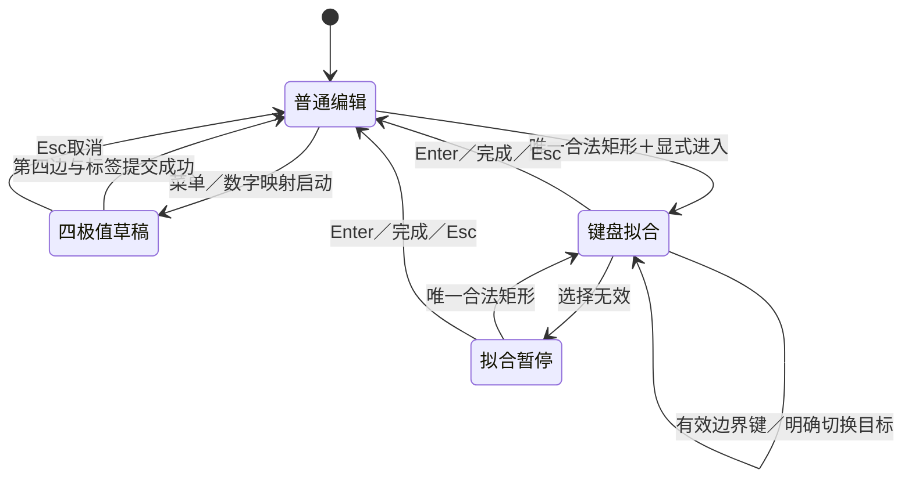

## Context

本文件为完整待实施功能设计，动机见 proposal.md。范围是普通水平矩形；“极值”指用户判断的边界位置，不代表算法识别或吸附。

当前代码核实结果：

- `RectangleWorkflow` 作为常驻 QWidget 插入主布局，顶部勾选决定事件过滤器是否工作；工具可用性和面板显示耦合。
- `submit_draft()` 在生成并选中新矩形后调用 `start_refinement(observe=False)`，必须移除这一自动衔接。
- 四极值按上→右→下→左采点，已有标签提交、草稿回退和普通 rectangle 格式。
- Q/W/E/R 默认分别对应自动标注加点、显示隐藏多边形、自动标注减点、创建矩形；直接注册同名全局快捷键会冲突。
- 数字键先判断绑定绘制，再判断选中形状重命名，最后根据分页映射绘制；管理器目前保存 `{mode, label}`，矩形绘制方法必须独立建模。

本设计取代 `design-rectangle-creation-and-refinement` 中主画面勾选、创建后进入修正的现有实现，以及相关旧变更中与本设计不一致的要求。保留其四极值顺序、坐标精度、标签事务、视图工具和单边精修能力。本次不修改其他未完成变更的任务勾选；实施时定向收敛旧规格，避免后续归档恢复旧行为。

## Goals / Non-Goals

**Goals:** 明确何时接管按键、何时结束；创建与修正独立；数字管理器能选择四极值；在同一套边名、键位、提示下提供可控的单边定位。

**Non-Goals:** 不做图像梯度吸附、轨迹滤波、旋转框或任意顺序极值创建；不修改标注口径，不自动填入质检结论，不承诺消除按键瞬间的光标误差。不重写整个快捷键系统，不改变模式外的数字重命名优先级。

## Decisions

### 1. 工具菜单为入口，创建与修正为独立任务

入口统一放入“工具 → 矩形工具”，不再通过主画面勾选启用。工具菜单始终可发现，根据图像及选择状态启用具体动作。

| 菜单动作 | 前置条件 | 结果 |
|---|---|---|
| 两点画框 | 已加载图像 | 调用已有普通矩形工具 |
| 四极值画框 | 已加载图像 | 新建上→右→下→左草稿 |
| 继续四极值画框 | 存在本次会话上次成功的标签和绘制方式 | 显式开始同标签新草稿 |
| 键盘快速拟合 | 唯一选中合法普通矩形、无进行中的鼠标拖动 | 进入独立拟合会话 |
| 单边精修 | 唯一选中合法普通矩形 | 显式进入已有精修能力 |
| 完成当前矩形操作 | 当前为拟合／旧精修，或四极值草稿完整 | 按当前任务完成；不强制保存文件 |
| 局部聚焦／适配对象／查看周边 | 沿用各自有效条件 | 显式执行视图动作 |
| 矩形快捷键设置 | 始终可用 | 打开对应设置分组 |

移除常驻面板及 enable 勾选；工作中才出现浮窗和必要的选边／步长控制。无需新增总开关。快捷键设置与入口 QAction 引用同一命令，默认“进入键盘拟合”快捷键为空，由用户配置，避免猜测空闲键位。

启动应用一律处于普通状态，不恢复正在创建或拟合的会话。旧 `rectangle_workflow.enabled` 不再具有运行含义。相较把原勾选原样搬到菜单，直接动作更清楚，也避免用户先启用再寻找入口。

### 2. 键盘拟合的触发、完成与退出

操作路径：选中矩形 → 工具菜单或自定义进入键 → 光标定位并按边界键 → Enter／退出键盘拟合／Esc。

- 进入时只授权当前操作，不移动任何边，不自动缩放或平移视图，浮窗显示目标与有效键。
- 每次独立按下边界键，读取当时光标并执行一次修改；按住不重复触发。修改立即进入内存标注和撤销历史。
- Enter、“退出键盘拟合”和 Esc 均结束独立拟合会话、移除其按键接管和浮窗，保留有效修改与当前选择。Esc 在本模式不是分级解锁，也不是回滚全部修改；浮窗明确显示“Esc 退出，Ctrl+Z 撤销”。旧单边精修内部 Esc 规则可保留。
- 完成不会额外保存文件；正常 dirty 标记、自动保存偏好和既有切图保存流程照常生效。
- 同图内选择另一个唯一合法矩形，继续本拟合会话但切换明确目标，清除上一目标反馈。悬停不能切换目标。
- 空选、多选或不支持形状时进入“拟合暂停：请选择一个普通矩形”，无几何修改，边界键与裸数字仍由本模式消费。重新唯一选中合法矩形后恢复。
- 焦点在文本输入／对话框时暂停画布捕获，不截获文字或完成键；返回画布后恢复。
- 成功切图、关闭图像、明确切换其他工具时结束拟合并清理暂态。切图被保存流程取消时保留会话。源目标删除后进入无目标暂停状态。
- 鼠标按钮按住、浮窗拖动或其他画布变换进行中，拒绝边界定位，禁止使用失效快照。



### 3. 创建完成即结束创建，不自动进入任何修正

两点与四极值创建均不自动进入旧精修或新拟合。四极值第四次有效输入完成后，走既有标签／属性／绑定提交事务；成功则选中新框，回到普通编辑，释放边界键及数字键接管。

浮窗可短暂显示“已创建；如需调整，请启动键盘快速拟合”，随后关闭。自动激活边、自动适配视图和自动开始下一框均不执行。用户可以普通编辑、显式拟合，或用“继续四极值画框”开始同标签下一框。

草稿仍采用上→右→下→左固定顺序，鼠标左键或当前边界键都能确认当前边。其他边界键提示步骤不符，不能跳步。Backspace／Ctrl+Z 撤回最近一边，空草稿撤销不穿透到标注历史；Esc 丢弃草稿。四边完成后标签对话框取消，保留可回退／重提交流程，不生成空标签形状。

数字启动键只负责进入草稿。例如普通状态按 1 启动四极值，即使 1 又是顶边键，这一次按下不能同时记录顶边；释放后再次独立按下才采点。第四边按下导致模式结束后，其自动重复事件也不能泄漏为重命名。

### 4. 可配置的边界映射与统一分派

新增四个边界定位设置：顶、右、底、左。QWER 为出厂边界预设，另提供 1234 预设及自定义单次组合键；边界映射在四极值草稿和独立键盘拟合中共用。

同模式内四边重复键禁止保存；Enter、Esc、Backspace、Tab、方向键、Ctrl+Z 等现有任务控制键不得用作边界键。组合键必须精确匹配修饰键，裸 R 不匹配 Ctrl+R。键盘主区和数字小键盘的无额外修饰数字统一为同一数字身份，NumLock 关闭产生的导航键仍按导航键处理。

设置界面区分“同状态冲突”和“受控临时重用”：前者禁止，后者仅允许已纳入统一分派的动作，并显示模式内外含义。不能简单把所有重复键加入白名单。没有完成覆盖审计的冲突组合必须拒绝，原映射保持不变。模式外原 QWER 功能不变。

| 优先级／状态 | 分派规则 |
|---|---|
| 文本输入／模态对话框焦点 | 交给输入控件；不应用画布路由 |
| 四极值草稿 | 边界键确认当前步骤；已映射但无效的键消费并提示；其余裸数字消费并提示草稿中标签操作暂停 |
| 键盘拟合或无目标暂停 | 边界键执行／拒绝并消费；其余裸数字消费并提示标签操作暂停 |
| 普通状态、绑定绘制开启 | 走原绑定绘制校验，再按映射绘制方法启动 |
| 普通编辑且有选中对象、重命名模式 | 走原数字重命名映射 |
| 普通无目标绘制情形 | 走原数字页与标签映射，再分派绘制方法 |

数字分页配置保留，不改写标签映射。暂停裸数字标签操作不等于接管所有含数字的组合键，例如 Ctrl+0 仍是原设置入口；实际进入对话框后暂停画布捕获。

实现上在现有 canvas `ShortcutOverride` 与实际按键分派中复用同一判定。按键所有权与几何可用性必须分开：顶边在下半区不可用，但该键仍属于拟合模式。释放按键时清理重复事件抑制标记；失焦及模式切换后保留抑制标记，避免仍按住的键泄漏到新模式。该标记不赋予操作权限；若释放事件落到其他窗口，下一次非重复按下会清除旧标记并重新判定。

### 5. 四极值接入数字快捷键管理器

数字管理器绘制方式下拉框提供“矩形（两点）”与“矩形（四极值）”，标签、数字页、清空、保存和重新打开体验保持一致。内部配置建议如下：

```yaml
digit_shortcuts:
  1:
    mode: rectangle
    label: person
    drawing_method: four_extremes
  2:
    mode: rectangle
    label: head
    drawing_method: two_points
```

`mode` 继续表示几何类型；`drawing_method` 只适用于 rectangle，缺省为 two_points。UI 将两个矩形选项序列化为相同 mode 加不同方法，不把 `four_extremes` 塞进 Shape 支持类型。普通标注 JSON 保持 `shape_type: rectangle`，不携带工具暂态。

数字映射读取、翻页保存、标签对话框回写和配置迁移统一保留该字段；不相关的消费者继续只读取标签或类型。未知方法不静默替换为两点，保留配置并提示修正，不能进入错误工具。

数字重命名模式下有选中对象时，裸数字仍然重命名，不因为该数字配置了四极值而改为绘制。要使用数字启动四极值，先取消选中；也可通过菜单或“继续四极值画框”显式启动。管理器在映射说明中显示该规则。

绑定绘制模式下：先沿用源对象、目标标签、Group ID 和同组重复检查；通过后，把绘制方法传入统一矩形创建入口。四极值使用与两点相同的绑定 pending 和成功提交事务；不能因草稿初始化的工具切换意外清空 pending。取消草稿、切图或校验失败不得回填源 gid，成功后才按现有原子提交规则处理。不放宽现有允许绑定的类别范围。

### 6. 半区保护与原图几何

每次定位使用本次执行前的框 `L,T,R,B`，中心 `cx=(L+R)/2, cy=(T+B)/2`。光标从当前屏幕位置换算到原图位置 `(x,y)`；只用对应轴改边，保持现有浮点精度。

| 边界 | 条件 | 修改 |
|---|---|---|
| 顶 | y < cy | T = y |
| 右 | x > cx | R = x |
| 底 | y > cy | B = y |
| 左 | x < cx | L = x |

半区以矩形中心线向图像范围延伸，允许光标在框外扩框。正好在水平中心线时顶／底均不可用，垂直中心线时左／右均不可用；中心点四边均不可用。每次成功修改、撤销、切换目标后重算可用状态；按键时再次校验，不能只信浮窗上一次的显示。

规则校验顺序：有效会话及目标 → 光标在当前图像有效范围、无鼠标按钮按住 → 半区 → 原图几何及最小尺寸 → 一次提交。原图范围沿用当前 `[0,width-1]`、`[0,height-1]`，创建至少 1px，已有边编辑若有更严格有效约束则复用。坐标非有限、越界、零尺寸和非法初始框均拒绝，不自动裁剪、交换边或修改其他三边。

这取代之前“反转后交换顶点”的讨论方案。未完成四极值草稿没有中心，使用步骤和已知对边合法性检查，不应用成框半区规则。

### 7. 浮窗与原有精修的一致性

浮窗只在任务进行时显示，默认画布右上角，可拖动并记住相对位置；缩放／窗口尺寸变化时约束在可见区域。浮窗不随每次鼠标移动漂移、不抢键盘焦点，不遮挡当前输入点时优先维持位置。空间不足可折叠为状态条，不新增常驻主画面面板。

```text
矩形工具 · 键盘拟合 · person
当前区域：左上
             [Q 顶 可用]
 [R 左 可用]              [W 右 不可用]
             [E 底 不可用]
本次：左边向右 2px
数字标签操作暂停
Enter 完成 · Esc 退出 · Ctrl+Z 撤销
```

使用实际配置键位。四极值状态改为“第 2/4 步：右边”，展示已确认步骤及可用输入；待标签提交期间显示待提交状态。边名／顺序统一上右下左，但四极值显示进度，拟合显示区域，不伪装成相同任务。

可用键正常显示并带文字，不可用键灰显；有效按下时按键及对应边高亮，短按至少保留约 180ms；拒绝按下显示警示符号及原因约 1 秒，连续拒绝仅更新提示，不弹模态对话框、不连续蜂鸣。可用状态仍实时刷新，不因反馈动画影响真实判定。

浮窗控制：完成／取消、撤销，以及拟合中的“选择活动边”按钮。选择边的按钮不按浮窗坐标定位，只设置活动边并将焦点交回画布。光标位于浮窗、菜单、侧栏或画布留白时，定位暂停并提示移回图像，禁止用旧鼠标位置。

拟合成功后激活该边并沿用方向键 1px、Shift+方向键 5px；步进属于已有精修语义，不依赖光标半区，仍遵守尺寸和图像范围。无活动边的方向键在独立拟合中消费并提示先定位／选边，避免移动整个框；不额外开启依赖鼠标点击的旧精修模式。已有局部聚焦等视图工具仍可显式调用，不在每次拟合后自动调整画面。

### 8. 事务、保存与模块职责

- 每次有实际变化的边界定位独立构成一个撤销单元，不与相邻定位、步进或创建合并；无变化／拒绝无 dirty、无撤销项。
- 创建仍是一次普通形状创建事务；四个临时采点不进入标注历史。创建后第一次拟合是独立事务，撤销应先撤销拟合，再撤销创建。
- 几何更新沿用既有形状身份、标签和属性；不能创建新 shape 替换原对象而丢失身份或关联。只通过既有通知／保存链路更新消费者。
- `RectangleWorkflow` 或从中拆出的协调器管理任务状态、菜单与 HUD；工具可用性不再依赖 QWidget 勾选状态。
- 半区／几何可用性独立为纯 Python 规则，与 Qt 输入分派分离；浮窗和执行都消费同一规则结果。
- 数字绘制解析返回 shape_type、label、drawing_method，通过公共入口启动；绑定事务上下文显式传递，取消和成功各有唯一清理点。
- `label_widget.py`、`canvas.py` 仅增加必要路由和事务接点，先定点搜索再批量修改，避免继续堆积大块新业务。

## Risks / Trade-offs

- [光标本身有误差] → 文案说明降低拖拽控制要求；保留固定像素步进与撤销，不宣称自动防抖。
- [QWER 已被占用／Qt 多入口分派] → 统一所有权判断，覆盖 ShortcutOverride、重复按键和拒绝分支；在未审计冲突上禁止配置。
- [1234 启动键又是采点键] → 一次按下只由启动前所属状态执行一个动作，释放后才接收下一次离散输入。
- [创建完成恢复数字重命名，用户误以为仍在采点] → 第四步完成明确反馈并关闭任务浮窗，重复事件不泄漏；连续创建用显式继续动作。
- [半区在中心附近变化] → 使用严格中心判定、实时可用提示、执行前重验；首版不增加隐藏滞后区。
- [数字绑定 pending 被工具切换清除] → 统一创建入口及原子提交回归；取消不得改变源对象。
- [旧配置读写丢失新方法] → 覆盖所有映射读写路径，并测试翻页／保存／重启往返。
- [新旧规划冲突] → 实施时更新旧行为描述为被本设计取代，不整份覆盖旧任务或将未完成项标已完成。

## Migration Plan

1. 先实现纯规则、映射兼容解析和作用域配置；旧映射无 drawing_method 时无损解释为两点。
2. 分离工具状态与常驻 UI，将菜单接入，删除主布局勾选入口；旧 enabled 可在读取时忽略，正式保存配置时移除，其他视图偏好保留。
3. 接通四极值数字启动和绑定提交；创建成功统一退出，不再自动精修。
4. 接通显式拟合、统一按键、半区保护和浮窗；配置修改只有校验成功后原子应用，新映射立即更新提示。
5. 完成相关 Qt／纯 Python 回归、翻译编译及人工交互验收，再收敛相关旧 OpenSpec 行为描述。
6. 回退应用版本不会改变 rectangle 标注文件；新版绘制方法配置保留备份。旧版可能忽略新字段并按两点绘制，因此回退时明确采用保存的旧配置，不承诺旧版继续支持四极值数字映射。

验收不预设效率提升百分比；在相同缩放和允许误差下，比较每种方式约 30 次调整的完成时间、一次成功率、撤销次数和主观费力程度。该人工评估验证体验，不能代替功能正确性检查。
