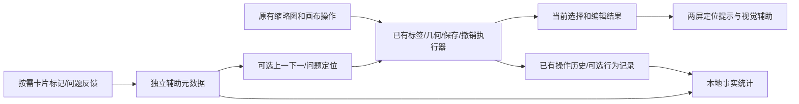
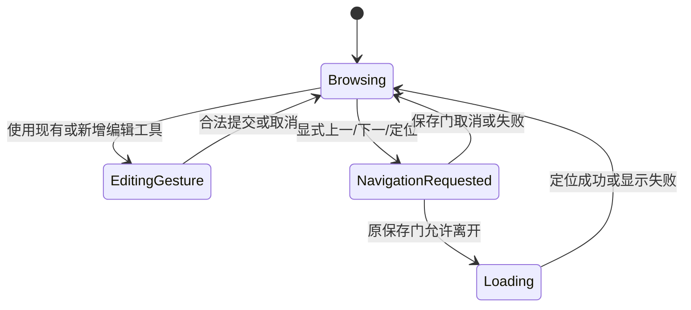

## Context

本版按最新讨论替换原“显式流程工作台”设计。**总中心是：保持现有浏览和编辑节奏，发现问题才操作，软件减少定位、辨认、输入和切换成本。** 原方案的强制任务分类、逐对象完成声明、确认驱动的队列推进不再作为实施依据。动机和四个能力边界见[proposal.md](proposal.md)。

本change名称与四个能力文件名保持不变，便于已有链接与追踪；其中session/task/workbench是技术命名，不要求用户启动会话、进入工作台或选择检查任务。四项能力是辅助功能，不是标注员必须依次完成的阶段。本次只更新设计，不修改应用代码。

### 当前基础

| 现有能力 | 实际用途 | 本版复用方向 |
|---|---|---|
| 同类缩略图、本页多选、数字改标 | 批量观察，选错项修改 | 保留；加强稳定位置和改类后的接续 |
| 双击/Enter定位主画面、显式反向定位 | 按需找回上下文 | 保留明确导航；不让普通选中改变另一窗口页码 |
| 卡片四态和浏览书签 | 用户可选的人工标记、位置记忆 | 继续可选，页面末项不是检查完成证明 |
| 几何编辑、键盘选边、单击调边、undo | 精确位置输入 | 复用；增加角/中心/两点重设，单次手势事务 |
| Focus、隔离、最终渲染决策 | 弱化重叠标注 | 增加无gid单对象反馈，与既有编辑动作连接 |
| 对象行为记录、操作历史、确定性导出 | 实际操作及时间事实 | 扩展来源、净变化和质量证据边界，不要求人工造日志 |
| QA与问题复核 | 发现候选、人工反馈 | 按需进入例外集合，不成为所有对象的必经入口 |

项目规模采用用户提供的5590份标签文件/125231个对象快照。没有原图实测证明新功能提速；真实图片和双屏验证在tasks保留未完成。当前树有多个在途修改，实施前仍须核对真实接口和定向基线。

## Goals / Non-Goals

**Goals:**

- 正确对象可以只被看见，不需要选择、修改、标记、确认或声明跳过；允许直接滚动、翻页或换图。
- 标签保持批量看、选择错误项改类；调框保留选中→键盘选边→鼠标定位置；两种工作可随时交叉。
- 上一/下一对象只定位；可选问题集合只帮助恢复例外，不能代表全量验收进度。
- 位置、实际操作、人工标记、质量证据分别建模；软件知道发生了什么，不猜用户为什么这样做。
- 所有辅助能力可独立使用；无第二屏、无标记、无规则配置、无日志或辅助存储故障时，原有标注功能仍可用。

**Non-Goals:**

- 不新增“先选类别/框任务→逐项确认→才能下一项”的流程管理器。
- 不通过自动标已确认或要求批量确认，让未操作对象获得未经证实的通过状态。
- 不把修改数当纠错数，把反复调整当误触，把长停留当辨认困难，把零操作当未检查。
- 不重新实现JSON写回、批量改标确认、undo、可编辑画布或通用跟踪；不自动删除重复框。
- 不设计云端模型调用、自动上传、多人实时协作、眼动识别；外部模型只能分析用户主动提供的包。

## Decisions

### D01．辅助命令与事实适配，保留既有入口

核心结构为“既有操作执行器 + 轻量导航/显示适配 + 被动事实观察”，不设要求所有交互先经过的流程协调器。编辑真实状态仍由既有Canvas、改标事务与保存服务负责。

对象上下文分为：
- browsing_anchor：页面/滚动/最后明确位置，用于恢复，不能表示看过哪些对象。
- batch_selection：经典本页多选，供批量改标/可选标记使用，和主画面当前对象不同。
- canvas_selection：既有真实选择；多选时不强行合成单一对象。
- active_edit_target：一次编辑手势冻结的唯一目标，结束后释放，不持有跨对象工作流锁。
- navigation_source：仅用户调用连续导航时建立的来源和顺序，未使用时为null。
- preview_target：只读候选或上下文预览，不自动变成正式选择、编辑目标或“已检查”。

新增纯逻辑可放object_review/的navigation、identity、mark_scope、operation_facts；Qt适配放widgets/，复用现有控件，避免再建立一套强制工作台。label_widget.py和canvas.py只接入必要信号和命令。quality/仍不引入PyQt。

**取舍：** 统一永久身份和事件关联，但不统一成人的必经流程；允许批次选择与当前编辑对象并存，通过作用域区分而不是强迫用户逐个操作。

### D02．四板块的流程与调框职责

| 板块 | 流程侧 | 调框侧 |
|---|---|---|
| 一 浏览连续性与记录 | 改类/刷新不丢锚点；保留可选标记；操作历史准确 | 上一/下一只是导航；记录修改和撤销 |
| 二 双屏与点击输入 | 两屏查看、显式定位、不切换人工工作阶段 | 原有选边点击为基准，角/中心/重设为可选工具 |
| 三 例外与分析 | 疑难按需收集、QA候选按需打开、后台事实统计 | 暂留待修项可集中处理，比较实际操作方式与重复调整 |
| 四 视觉辅助 | 类别颜色保留、文字稀疏、上下文可见 | 当前对象/活动边强调、重叠候选选择、手势防误改 |

功能启用使用现有设置和可见按钮；没有总“开始检查”向导。类别选择器仍然是数据筛选，不是声明认知任务。任何时刻都允许在合法保存/草稿约束内改类、调框、补漏或删除；不要求先填写错误类型。

### D03．永久身份与内容版本

持久关联使用数据集+图片+永久Shape ID；规范化图片/JSON locator独立，支持分目录存放。数组下标仅显示顺序，bbox、basename、内存id和临时短码不能代替身份。缺失/重复ID时只禁用依赖唯一身份的新增定位、标记或跨文件操作，给出原因；不因辅助功能无法识别就全局禁止用户按原画布能力查看/编辑，也不偷偷补写ID。

数组重排不改变身份；复制创建新身份，不继承人工标记；删除及其撤销用原有事务身份关联。路径移动需要显式、可验证的重新定位；不能按同名文件自动迁移。内容变化按图像、label、geometry及相关属性分别保留版本；图片内容/尺寸改变使旧基准不可靠。图像指纹按需后台验证，不为每次浏览全量哈希。

新增可选标记可记录作用范围category/geometry/unspecified，但scope不是工作模式，不影响可用编辑命令。未使用新标记的对象不建立待确认记录或完整状态机。既有通用标记沿用原整shape signature失效规则；新增明确scope标记只影响自己的有效性，不要求所有旧记录改成双维度。

### D04．位置恢复和改类后稳定浏览

复用现有incremental/page_diff/书签逻辑。画面刷新以对象身份锚定，保留未变化卡片、滚动、选中项和键盘位置，只有实际影响当前查询的变化才局部更新。

| 情况 | 接续规则 |
|---|---|
| 当前卡片改类后消失 | 保留修改前邻近对象身份；以尚在结果中的后继承接，无后继用前驱，并提示已离开当前筛选 |
| 一次改多个对象 | 按冻结本页范围提交，改完后以原锚点附近仍存在对象接续，不把补进页面的新项算入旧批次 |
| 目标跨分页边界 | 按身份查询位置；页码只是显示，不以旧offset盲跳 |
| 无关文件修改 | 不清空当前卡片图片和浏览锚点 |
| 图像缺失/身份不明 | 显示占位；不记录已处理或已通过 |
| 关闭/重启/清缓存 | 恢复书签和筛选；注明这是浏览位置，不代表此前全部看过 |

保存锚点是辅助持久化，可合并写入；失败给非模态提示，仍可继续浏览。不能因为“最后单击对象”记录存在，就制造此前所有对象的复核状态。

### D05．可选连续导航，独立于确认和保存

“上一对象/下一对象”是独立命令，可从当前缩略图查询、显式选定的例外集合或既有矩形对象次序提供来源；工具栏显示本次来源，不要求创建任务。用户未使用该功能时完全沿用原浏览方式。

首次明确调用“沿当前结果导航”时冻结轻量对象键顺序；为避免每次选项，后续沿同一来源连续使用。这不是批次选择快照，不能交给批量改标执行器。主动换筛选/更换来源时更新导航来源并显示结果；普通保存导致的改类不会擅自重建顺序。大型来源按分页/磁盘有界维护对象键，不加载全部图片。

- 当前对象改类或删除，仍按原稳定后继寻找下一对象，不按缩短后的列表offset跳项。
- 新增对象可显式刷新导航来源或在普通浏览中直接访问；没有全量待办倒计时，不把队列外新增对象强塞给用户。
- 上一项沿实际访问轨迹返回，不撤销编辑或标记。离开来源查看别的目标无需声明暂停，不确认旧对象；返回导航入口恢复原锚点。
- 到末尾显示“当前导航范围已到末尾”，不说“检查全部完成”。缺失项数量可提示，但不等于质量问题数。
- 下一目标读取失败保持当前有效画面，指针不提前消费；提供重试/选择其他项，不重放任何编辑。

保存完全遵循现有机制：同图导航通常不要求保存；跨图时按may_continue及用户已有自动保存设置执行保存/丢弃/取消。普通下一对象不新加自动保存、不自动写确认；已有批量改标确认和立即写盘规则保留。

存在未提交两点草稿时遵循已有草稿提交/取消/切换语义，不把导航当作隐式提交，也不增加“检查完成”步骤。异步导航使用generation/request_id；迟到图片可入缓存，不能覆盖新目标。程序同步不再次发起反向定位，不重复记录用户操作。

**取舍：** 删除原complete_next及“保存→记录确认→才推进”的事务链。导航正确性依赖原保存服务和目标校验，不依赖复核数据库。

### D06．可选人工标记不制造新负担

保留现有未检查/已确认/待修改/暂跳过入口，本页一个或多个对象可选标记。新面板可简化直接按钮，并允许选择“类别/框/未指定”作用范围；默认未指定，常用scope可记忆，不要求每次填写。不开面板、不设置任何标记也能完成全部标注工作。

三种事实独立显示：
1. 位置：最后页、滚动锚点、明确激活对象。
2. 操作：发生过改类、调框、删除、撤销，或当前未保存。
3. 人工声明：用户明确设置了某种标记，是否仍适用于当前内容。

“修改过”不能自动转为待修改、已确认或质量通过；“没有改动”也不能自动转为已确认或必须补检查。翻页不标记整页；提供批量标记时必须冻结明确选择，未选卡片/页外卡片不加入。

通用旧标记原样保留，不强迫迁移，也不推断旧已确认代表类别和框都通过。新增明确scope标记绑定内容版本；类别变化使类别标记过期，几何变化默认使几何及依赖其视觉证据的类别标记过期；图像变化使相关标记过期。过期仅显示参考已过期，不自动创建必须重做的队列或禁止编辑。

用户可撤回标记，和几何undo分开。标记写入失败只报告本次标记未保存，编辑/翻页/导航继续可用。已有内容新旧版本无法比较时给unknown，不把标记错误套到另一个对象。

### D07．存储与兼容：不部署旧版流程数据库

继续复用review数据库、历史、书签和行为日志。只增加辅助所需的数据，不建立旧设计的任务目标、每对象完成状态、确认命令恢复日志及全量assessment管理器。

| 数据 | 持久化方式 | 故障/关闭时行为 |
|---|---|---|
| 浏览锚点、显示/双屏偏好 | 现有review_state/QSettings扩展 | 提示无法保存位置，原编辑继续 |
| 可选连续导航来源与游标 | 轻量navigation metadata，按需创建 | 内存导航或原有浏览降级，不宣称进度完成 |
| 原卡片标记、操作历史 | 原表和原事务 | 原含义不变 |
| 新标记scope、版本和问题关联 | 版本化附加表，按明确操作写入 | 本次操作失败显示原因，不阻塞JSON编辑 |
| 详细语义事件/时间 | 现有本地JSONL，默认关闭 | 失败不阻塞，导出显示覆盖缺口 |
| 质量抽检证据 | 读取既有报告/明确导入快照 | 不存在则不生成通过类指标 |

新增存储schema升级前备份、短事务、可回滚；不覆写旧marks。多窗口对同一标记修改按既有写锁和版本比较处理，冲突不覆盖新值。无需为了辅助存储建立独占整个数据集的工作会话。

本版前一轮设计并未实施，不应按其纸面wb_表方案编写迁移。实施时如实际检测到实验性旧schema，备份并只读保留，报告来源不兼容；不把旧任务完成数当作新版本事实。降级或关闭辅助功能不回滚已提交JSON，缓存清理不删除人工标记/历史。

### D08．双屏联动沿用显式导航

缩略图窗口放A屏，主画面放B屏，仍只有一个Canvas、一份选择和undo。无需额外“开始复核”按钮。复用双击/Enter/定位菜单；可选联动按钮只连接明确导航命令并同步只读身份提示，不改变普通单击选卡片、批量选择或主画面普通选择不反向翻页的契约。

类别检查时鼠标通常停留A屏；需要上下文再显式定位B屏。框修改时鼠标留在B屏，使用上一/下一命令沿当前来源定位；A可显示独立定位标记，但不得把它加入批量改标选择。没有导航来源时保留现有下一对象行为或清楚提示可选来源，不启动任务向导。

同图下一对象已可见时保持缩放/位置；不可见则平移。跨图或用户要求时适应对象与周边，自动适应是独立偏好，不默认每次跳动。回到缩略图保留原锚点；从B切回A不要求恢复任务状态。

窗口位置使用Qt逻辑像素与屏幕可用区域；混合DPI、屏幕负坐标、断屏、主屏改变、重启均要回到可用区域。断屏只改变布局，不改变标注、标记、导航身份。应用内窗口间切换不等于退出应用；未结束鼠标手势不得跨窗口提交。

### D09．点击输入扩展，不替换熟练操作

| 用户看到的问题 | 可用操作 | 约束 |
|---|---|---|
| 单边偏差 | 原有键盘选边＋点击新位置；也可用已有候选边预览 | 左右只取x、上下只取y；其余三边不变 |
| 两条相邻边偏差 | 明确选角＋点击 | 对角保持，跨越对边时拒绝 |
| 整体偏移 | 明确移中心＋点击新中心 | 宽高不变；越界拒绝，不暗中缩小 |
| 大部分边界不合适 | 两点重设当前矩形 | 第一点草稿、第二点合法后一次提交，保留ID/label/其他字段 |
| 轻微偏差 | 现有键盘/滚轮微调 | 沿用原图像素单位及已有步长 |
| 看不清 | 查看原图/附近范围，或按需标疑难 | 不要求改框、标记或填写原因才能离开 |

工具选择只表达怎样输入位置，不要求用户声明错误类别；不从所选工具反推真实错误类型。选择对象一次后可以连续修改多条边，也可随时正常改类；一次位置提交不自动跳到下个对象。

预览不改points/dirty/undo；一次合法提交对应一次规范编辑动作和一次原有撤销。坐标按本画布转换到原图，保持2点/4点矩形既有表达；有限值、正面积和图像范围校验保留。两点反向点序可规范化，非法/越界拒绝不自动纠正用户意图。

点击按下位置冻结，释放用于校验同一手势；超过拖动阈值只取消或转交已有拖动一次，不能点击和拖动双提交。目标身份冻结仅覆盖当前手势/两点草稿，结束即释放；没有持久“当前对象锁”，不要求额外解锁才能选邻人。原有明确进入的单边精修模式可以保持自身既有选择规则，但本次不再叠加新工作流锁。

### D10．输入冲突、保存和异常恢复

优先级为文本/模态 → 活动几何手势 → 已启用工具快捷键 → 显式辅助导航 → 原有操作。相同事件只能被一个处理器消费；QWER、数字标签、Tab、Enter、F1/F2、Ctrl+Z的现有含义保持，新动作进入快捷键schema，默认不抢占，按钮始终可用。

同一命令重复事件做去重，但不能以用户未确认对象为理由禁止正常重复导航。长按下一对象的处理遵循现有键盘导航节流，不能派生确认或删除。输入框中按数字只输入文字。模态/失焦时清理未提交手势和按住式预览，已提交编辑保留。

| 异常 | 要求 |
|---|---|
| 同图有未保存编辑，继续选其他框 | 按原行为继续，不要求“完成当前项” |
| 跨图保存取消/失败 | 保留原画面和脏编辑，不提前消费下一目标 |
| 标签批次写回部分失败 | 原结果/恢复机制保留，成功与失败项分别呈现，不扩大批次 |
| JSON成功、索引失败 | 保留真实保存结果，按原索引屏障限制依赖陈旧索引的操作，普通可用画布功能不额外封锁 |
| 标记/书签/日志失败 | 提示对应辅助失败，不回滚JSON、不阻止继续编辑和普通导航 |
| 辅助导航身份失效 | 本次新增定位拒绝，允许用户回到原浏览/画布方式 |
| 加载旧请求迟到 | 不覆盖新目标，不生成额外编辑或人为“完成” |

Ctrl+Z只沿用已有几何/标签撤销语义；标记撤回独立。完全恢复原内容时记录净变化为零，但仍保留期间实际操作与耗时；不直接认定它是误触。

### D11．视觉反馈由动作驱动，预设只是偏好

当前对象高亮来源于明确选择；活动边来源于实际使用的编辑工具。不要求选择“类别检查/框检查”任务。可保存显示偏好：选中时弱化背景、编辑时仅显示当前、需要时看附近框、临时看原图；用户可随时关闭。

| 当前交互 | 显示建议 | 不产生的副作用 |
|---|---|---|
| 普通浏览 | 类别颜色、细轮廓、稀疏文字、无明显填充 | 不设置已看过/通过状态 |
| 明确选中一个框 | 当前完整轮廓最后绘制，其他框按偏好弱化 | 不强制把多选改成单选，不移动缩略图页码 |
| 编辑边/角 | 活动边突出，仅当前控制点，无明显填充 | 不压暗原图人物/手/桌面，不锁定后续流程 |
| A/B对照 | 两候选短码/颜色/非颜色辅助，可单看 | 不判定重复、不改变几何 |
| 查看原图/附近框 | 临时去标注或恢复相关标注 | 不切换工作阶段，不写JSON |

增加object_focus，独立于group_focus；无gid也能弱化其他框，共享gid不自动强调其他学生。组聚焦仍供原person/head/face用途。类别名与色块、当前对象短码、编辑方式放在固定信息区，避免边框同时承载类别/身份/状态全部含义；短码绑定永久身份，不写group_id。

最终渲染决策统一几何、文字、GID、尺寸、装饰与命中；隐藏框不能留下标签或可点击隐形对象。基础过滤先于辅助偏好，不暗中复活用户隐藏类别。目标被过滤时提示，用户明确临时显示后再输入几何；不把该提示变成全局阻止浏览的任务门。

候选选择复用现有命中排序，只在重叠难选时可打开列表/循环预览；预览不改正式选择。普通选中后仍可按原方式选择其他对象；仅活动手势冻结目标。完全重合的框分别显示A/B，不人为错位边线。临时显示在松键/取消/失焦/切图时清理，进入前偏好可恢复。

### D12．例外集合和质量证据都是可选旁路

人工可在看到疑难时按原卡片标记或快捷入口留下“类别不确定/几何需改/疑似重复/目标归属不清/图像证据不足/其他”；允许无原因标记，后续再补，不要求正确对象标记、未修改对象选择跳过。unknow按项目待分类解释，可直接改为明确类别，也可暂时不处理，不自动等于困难或最终类别。

问题集合只包含用户主动标记或明确运行/导入QA得到的候选。软件可以展示候选数量，但普通浏览不因候选未处理而受限；改对象也不自动关闭全部问题。用户可自由从问题列表回到普通图像，离开不要求结束会话。

跨类重复候选限定用户明确配置的动作矩形标签范围；本项目六个现有标签可预填但由扫描入口显示范围。保留现有通用同类规则，不把person/head/face合法嵌套放宽为重复。先空间筛选再计算IoU/中心差/边差/面积比，试验阈值IoU≥0.90仅提示疑似并记录版本；不自动删除/合并或按模型分数保留。无序对象对身份稳定，内容证据版本单独保存；复扫消失保留历史，不推断保留框正确。

QA旧报告只有路径/下标时须验证对应版本上的永久身份；无法验证提示复扫，不猜当前同下标对象。人工反馈仍走原feedback入口，状态与实际标注变更分离。

整图查漏沿用用户实际看图方式，提供原图/所有基础可见框显示和筛选范围提示即可。可以自愿记“本图/本批查漏已做”，但不是换图条件；若用户留下声明，记录实际范围和版本，过滤中的声明注明范围有限而非完整覆盖。已有框全部未改/全部标记都不能证明没有漏人。

质量抽检/复核记录从已有反馈或明确导入关联，包括对象、范围、检查维度、内容/规则版本、结论、本人自查/声明独立复核。不存在这些证据时显示质量未知，不新增每日必填的质量流程。软件不替用户规定动作互斥、遮挡边界或容差；相关规则只用于明确QA或效果试验时记录版本，不作为普通编辑的启动门。

### D13．记录实际操作，不记录想象中的认知过程

沿用behavior_analytics默认关闭开关；启用后后台观察，不要求开始每个对象、选择任务、计时打点或声明完成。事件依赖既有语义动作边界，禁止把程序刷新/反向同步当成人的输入。

| 事实类别 | 记录内容 | 不能据此推断 |
|---|---|---|
| 视图/位置 | 页面、过滤快照、明确导航、加载等待、窗口角色 | 本页每个对象都看过 |
| 对象访问 | 明确选择/激活与离开、来源、对象身份 | 所选对象已经正确或检查完 |
| 内容变化 | 前后版本、改类/单边/角/平移/重设、成功/取消/拒绝 | 原对象有错或新值正确 |
| 恢复 | undo/redo、再次修改、恢复基准、保存后再编辑 | 一定误触或质量返工 |
| 自愿标记/反馈 | 真实用户声明及scope、版本、证据来源 | 声明之外的其他对象也通过 |
| 显示工具 | 实际颜色/弱化/隔离/输入工具与版本 | 用户正在执行某个必经认知阶段 |

A→B→A保留不同visit，汇总同一对象；未选中的批量浏览保留批次/项目区间，不均分精确单对象辨认时间。批量改标一次操作关联多个对象，但批次时长不能复制到每个对象后再求总和。纯鼠标悬停不自动建立完整处理episode。

wall/focused/active/action分别报告；应用内两屏焦点合并不双算、不误排除，应用外失焦/手动暂停/空闲阈值按已有规则并附版本。无输入区间保持未归属停留，不能自动算休息或判断困难。导航等待与编辑时长分开，区间求并集；跨重启不相减单调时钟，缺边界给unknown。

同一编辑执行器只生成一次规范动作，新增适配只补关联。日志失败不影响保存/undo/导航，记录丢失计入coverage。关闭记录期间不补造时间；操作历史可提供有限变更事实，不能当作精确计时来源。无需录逐帧鼠标路径或截图；跨屏指针移动次数若无专用可靠采集，标不可用而不从窗口切换猜测。

### D14．净变化、重复调整和效率的准确口径

分析以显式选择的记录时间范围/数据集/操作对象集合为分母，不依赖用户逐对象确认。每个对象的“净变化”基准为所选记录范围内首次可验证的内容版本，终点为截止时可验证的落盘版本；若仅知内存版本，分开报“内存变化”，不冒充已保存。缺任一端版本给unknown。基准不是人工真值，也不是自动认定的原始错误标签。

| 指标 | 定义和边界 |
|---|---|
| 实际操作次数/耗时 | 按规范action去重，区分提交、取消、拒绝；同手势不双算 |
| 发生修改的对象数 | 范围内至少一次真实内容变更的去重对象数，包含后来撤销者 |
| 已保存净变化对象数 | 可验证起止业务内容不同的对象数；不叫成功纠错对象数 |
| 恢复到基准对象数 | 曾变化且截止恢复基准；保留期间耗时，不直接叫误触 |
| 再次调整 | 多次访问/保存后再修改等观测事实，注明具体定义 |
| 已证实返工 | 有明确复核退回/人工原因的再处理子集；无证据仅报再次调整 |
| 操作效率 | 同一覆盖范围的实际修改或净变化对象数/项目记录工时；不是检查吞吐 |
| 检查速度 | 有明确批次范围、批次已浏览声明和相应工时才计算，标为批次声明口径 |
| 质量结果 | 仅对版本和范围匹配的抽检/复核子集报告；未修改对象质量默认未知 |

四边同一框只算一个变化对象；label+geometry均变可分别按维度统计但总数仍去重；完全undo后修改对象数保留、净变化数为0；redo再次形成净变化只更新结果，不重新增加对象身份数。删除/新增单列不混进保留对象净变化；删除不自动叫成功纠错。

保存后的其他进程/外部修改且没有可归属动作时，标external_or_unattributed，不把变化算到本操作者。多选操作的批次区间作为共享成本，单对象可关联但不可重复求和。

保留进入记录时类别token与截止类别token，按源类别和实际操作方式分析，改类不使原成本消失。操作方式不是错误类型，没有问题原因则错误类型unknown。不要根据“用两点重设”推断四条边原本都错。

对比旧新功能时按难度匹配的批次、相近规则、操作类型与软件/显示版本分组，交替顺序降低熟悉效应。正确对象多的批次修改吞吐可能低，不能直接断言效率差；必须同时报告工作量/缺陷构成、导航等待及抽检覆盖。部分日志缺失时，只对可匹配覆盖子集计算并显示分母；100个改动仅40个有计时时不能100除以40个对象的工时。

若用户没有批次声明或抽检数据，就只报告操作事实，不能为了补指标要求补做逐项确认。已有自愿已确认标记只证明明确声明范围，不升级为独立复核。独立复核时间缺失时，不计算含复核工时的综合效率。

### D15．本地分析包、隐私和容量

复用现有bundle/timeline。建议增加operation_object_summary.csv（访问、编辑方式、起止可验证版本、保存净变化/unknown）、navigation_costs.csv、optional_marks.jsonl、quality_evidence_summary.csv及measurement_quality.json。原有文件保持兼容或明确schema升级；不要继续输出旧方案的全量“review完成进度”。

包需附analysis_readme：字段、时间区间、scope、coverage、基准版本、操作与认知的区别、不得推断项及适合大模型的问题。汇总可追溯到明细；确定性计算由程序完成，模型解释趋势和建议试验，不补missing数据、不判定误触原因、不以改动多证明质量高。

默认外部包无图像、完整points、绝对路径、自由文本、真实操作者名及原label；本机可以比较内容而仅输出差异类型/计数和匿名类别token。用户主动选择可附类别词表，本地匿名盐不导出。没有自动上传或应用内模型调用。

125231对象/5590文件为容量档：仍按当前页最多100项、可见裁剪和有界预取；可选导航只保存轻量身份。指纹、QA、导出在后台且可取消，旧结果有generation屏障。大包超过预算时停止完整发布并提示缩小范围；分卷须manifest/校验和/总数，不能静默截断后声称全量证据。

试验性能预算：同图缓存就绪下一对象稳定显示P95≤150ms、辅助反馈P95≤100ms、普通输入无>100ms连续主线程阻塞；冷图解码单列。预算是固定机器待验收目标，不是既有实测结果。所有用户文字本地化，ts→qm/resources走脚本。

### D16．阶段与验收

四板块的实现分批不限制用户工作顺序。

| 阶段 | 交付 | 必须证明 |
|---|---|---|
| G0 基线 | 旧操作脚本、入口/在途变更审计、测量范围 | 当前批量浏览/改类/选边点击可复现 |
| G1 连续性与记录 | 锚点、可选前后项、标记扩展和真实事件 | 正确对象零新增操作，下一项不写确认，辅助失败可继续 |
| G2 视觉 | 无gid单对象强调、显示偏好、候选/A-B | 不要求先选任务，手势外仍能正常选对象，无隐形命中 |
| G3 双屏与点击 | 原操作兼容、角/中心/重设、布局/输入 | 标签与调框自由交叉，双屏/DPI/保存/undo正确 |
| G4 例外与分析 | 可选QA/疑难、净变化/再次调整/覆盖和导出 | 没有操作不判未检查/已通过，有修改不判纠错/误触 |
| G5 综合 | 容量、失败恢复、真实人工对照、操作说明 | 功能通过与提速/质量证据分开报告 |

G1接记录，G2/G3继续补实际显示与操作方式事件，G4形成完整分析，不能等G4才有基线。每阶段测试正例与失败场景，未真实接双屏不勾选双屏人工验收，未抽检不声称质量已通过。

关键端到端验收脚本：
1. 一页100个正确卡片，用户只看、滚动、翻页；新增选择/标记/确认次数为0，无虚构通过数。
2. 一页3个错类对象，按原方式多选改标，只有原有必要交互；未选卡片和补入页面卡片不加入批次。
3. 改类时发现框偏，直接双击到画布调边，再回缩略图继续；无类别/框任务切换。
4. 同一框两次边调整后直接选邻框；不需要完成声明或解除新增对象锁。
5. 连续导航跨图遇保存失败保持原位；标记库/日志失败不阻止正常编辑。
6. 一次修改完全撤销，报发生修改但净变化0；原因未知，不称误触。
7. 只浏览无编辑的批次，报告观察区间而非精确已检查数；若自愿提供批次声明及抽检，按范围单独分析。
8. 关闭所有新增辅助后原操作和标注文件保持兼容。

人工试验采用难度匹配的不同图片组，交替基线/新方式，记录规则/显示/输入版本、操作次数、项目耗时、等待、净变化和抽检。首轮每种待比较方式至少30个有效操作访问只作诊断下限，不是显著性保证；不得为了达数量要求用户多点正确对象。

## Risks / Trade-offs

- [Risk] 增加辅助面板反而增加操作 → 以正确对象零新增交互、错误项沿原操作完成作为硬验收；标记/队列/分析可全部不使用。
- [Risk] 锚点恢复被误当进度 → 始终标“浏览位置”，没有证据不显示全量检查率。
- [Risk] 净变化被模型解释为纠错 → 包含明确口径与质量unknown，原始基准不等于真值。
- [Risk] 显示隔离掩盖漏检/重复 → 原图/附近框/基础筛选提示始终可用，用户可自由恢复全图；不宣称隔离下完整查漏。
- [Risk] 点击模式和选对象含义冲突 → 复用原工具状态，只有手势期冻结目标；无新增跨对象强锁。
- [Risk] 元数据失败导致业务被绑架 → 故障只影响相应辅助结果，原JSON编辑/保存不依赖其成功。
- [Risk] 批量共享时间被重复分配 → 批次区间独立、对象关联不复制耗时，coverage明确。
- [Trade-off] 不强制确认就无法准确计全量检查通过数 → 接受这个测量边界，按操作事实与可选批次/抽检评估。
- [Trade-off] 旧通用标记scope未知 → 原样保留并标来源，不强迫迁移、不扩大含义。
- [Risk] 在途代码与旧方案残留冲突 → 实施前审计当前树，本版规格完整替换旧流程契约，测试不得继续要求complete_next主链。

## Migration Plan

1. 保持change和四个能力标识，发布本版文档为后续唯一实施依据；旧设计没有落地的schema不作为必须迁移的现有事实。
2. 审计原入口/保存/选择/快捷键/显示/日志，建立无新增交互基线；不覆盖用户未提交修改。
3. 仅在实际需要持久化新增标记或导航偏好时升级对应辅助schema，备份并可回滚；不要求启动新的任务库或映射所有旧确认。
4. 分批上线辅助按钮和偏好，保留现有默认行为；记录开关独立，未开启时不采集细粒度时间。
5. 任一辅助回归可单独停用，恢复进入前显示/窗口偏好；标注、旧标记和操作历史保留。
6. 文档用“浏览连续性/点击工具/显示辅助/例外与分析”介绍功能，不引导标注员按四阶段逐对象走流程。

## Open Questions

以下为可后续试验的内容，不改变本版无需任务分类和确认的行为：
- 双屏DPI/尺寸、常用缩放、侧键与新工具绑定偏好；默认不抢原快捷键。
- 背景弱化比例、上下文padding、候选阈值；作为可配置试验参数，记录版本。
- 项目动作互斥、遮挡和框容差标准以及可提供的抽检范围；仅影响QA/效果解释，不作为普通标注的开启条件。
